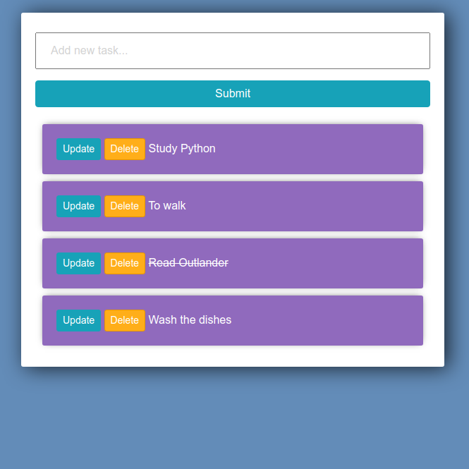

<h1 align="center">TODO WEB APP</h1>

A basic To Do App build using Django. In this web app can create notes like Google Keep or Evernote.

Dependencies
------------

 <b>Django</b> 
 to install django <code>$ pip install django</code>
  
 <a href="https://www.geeksforgeeks.org/django-introduction-and-installation/">read more about installation</a>
 
 
Basic setup
------------

<pre>$ git clone https://github.com/RaquelRufino/ToDo-Django </pre>
<pre>$ cd ToDo-Django </pre>
<pre>$ python manage.py makemigrations && python manage.py migrate</pre>

Now, run the server to see your todo app
<pre>$ python manage.py runserver</pre>

Screenshot  
------------

  
  
